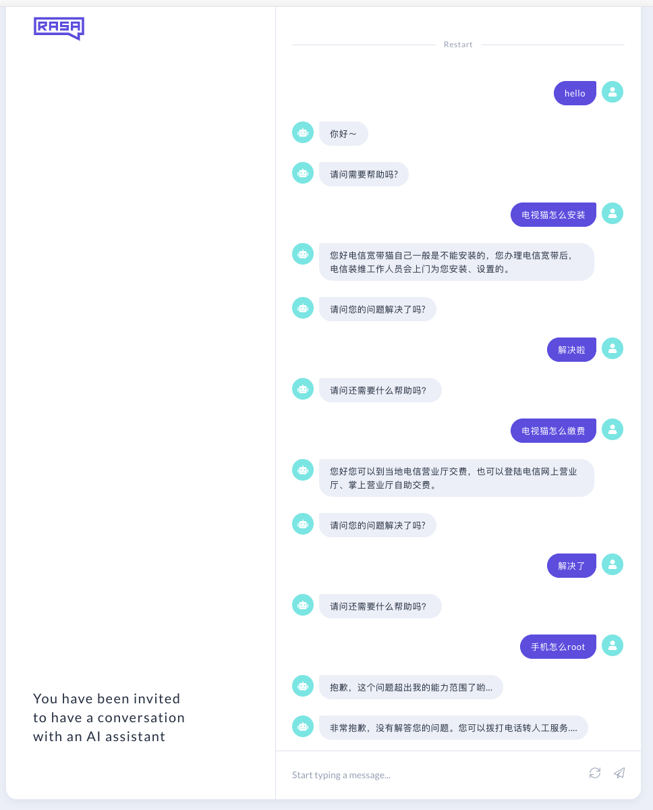

<h1 align="center">rasa-faq-bot</h1>
<center> Using Rasa to build a FAQ bot, [中文版本](https://github.com/nghuyong/rasa-faq-bot/tree/chinese) </center>


<p align="center">
  <a href="https://github.com/nghuyong/rasa-faq-bot/stargazers">
    
  </a>
  <a href="https://github.com/nghuyong/rasa-faq-bot/issues">
        
  </a>
  <a href="https://github.com/nghuyong/rasa-faq-bot/">
        
  </a>
  <a href="https://github.com/nghuyong/rasa-faq-bot/blob/master/LICENSE">
        
  </a>
</p>

<h2 align="center">Introduction</h2>

[Rasa](https://rasa.com/) is a powerful dialog framework that we can easily use it to build a practical dialog system.

FAQ(Frequently Asked Questions) bot is the most important part of the smart customer service products, which help users to solve general problems.

Usually we collect common questions and answers from actual scenarios and we call these standard question-and-answer pairs for the knowledge base.
FAQ-bot will intelligently answer user questions based on this knowledge base.

So, in this project, we will use Rasa to build a smart faq-bot!


<h2 align="center">Get Started</h2>

**1. Run the shell and activate bert-service**

We store the knowledge in data/nlu/faq.json，which includes lots of question-and-answer pairs. We use bert-service to calculate the similarity between the user question and the questions in the knowledge base. Then we choose the most similar question and return the corresponding answer to the user.

* Specific operation：
	* Install bert-serving-server and bert-serving-client，More information about [bert-as-service](https://github.com/hanxiao/bert-as-service)
	* Download pre-trained BERT model，unzip it(for example, cased_L-24_H-1024_A-16.zip).
	* Next, you need to change "BERT_ENGLISH_MODEL_DIR" into your model path
	```latex
     -bert-serving-start \
     -pooling_layer -4 -3 -2 -1 \
     -model_dir=BERT_ENGLISH_MODLE_DIR \
     -num_worker=8 \
     -max_seq_len=16
    ```
	* Run the shell
	```bash 
	./run_bert_service.sh
	```

**2. Run Rasa custom actions**

We design our own customer actions in actions.py which which is how the dialog responds to the user when it receives the customer's information. If the user's intent is faq, then go to the knowledge base to find the best match and give the user answers. If there is no match to the right question, we will also tell the user "Sorry, this question is beyond my ability."

* Change the port in endpoints.yml to keep the port the same as the port of rasa actions(default port is 5055):

```latex
action_endpoint:
  url: "http://localhost:5055/webhook"
```

* Run rasa actions：

```bash
rasa run actions
```

Then you can get a log like this:

```latex
│2019-08-09 11:10:32 INFO     rasa_sdk.endpoint  - Starting action endpoint server...
│(1000, 3072)
│2019-08-09 11:10:33 INFO     rasa_sdk.executor  - Registered function for 'action_get_answer'.
│2019-08-09 11:10:33 INFO     rasa_sdk.endpoint  - Action endpoint is up and running. on ('0.0.0.0', 5055)
```

**3. Run Rasa X**

* Install [Rasa X](https://rasa.com/docs/rasa-x/installation-and-setup/)

* Run Rasa X

```bash
rasa x
```

And you can get a log like this:

```latex
Starting Rasa X in local mode... �🚀                                                                                               
 
The server is running at http://localhost:5005/login?username=me&password=zrjV0BwYSzYP
```

Copy the link into your browser, then you can access your rasa x page.


<h2 align="center">Dialog example</h2>




**4. Note**

* Sometimes when the service is started, the port is already in use. At this time, it is better to kill the process of the relevant port directly.
* If the error is about the database is locked，just delete rasa.db and tracker.db.
* You'd better use compatible rasa and rasa x，this project uses rasa 1.2.2 and rasa x 0.20.1(they are compatible)
* Use your own data to train a model:
	* Follow the data foemat in data/nlu/faq.json，replace it by your own data
	* Run process.py(Default data size is at most 1000 pieces，you can modify the process.py on your own)
	* Run actions.py
